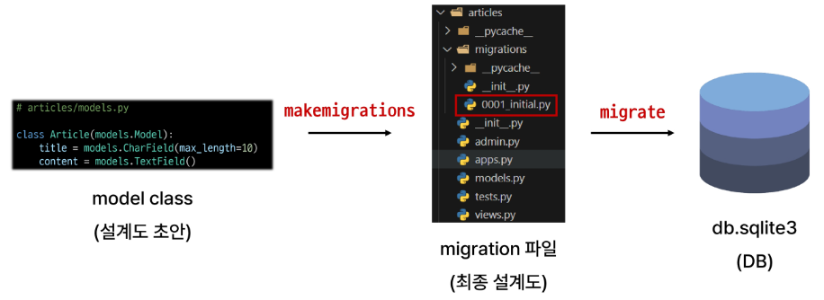
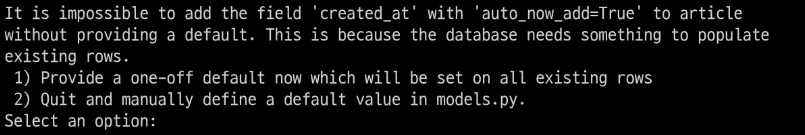
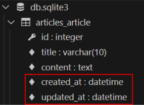
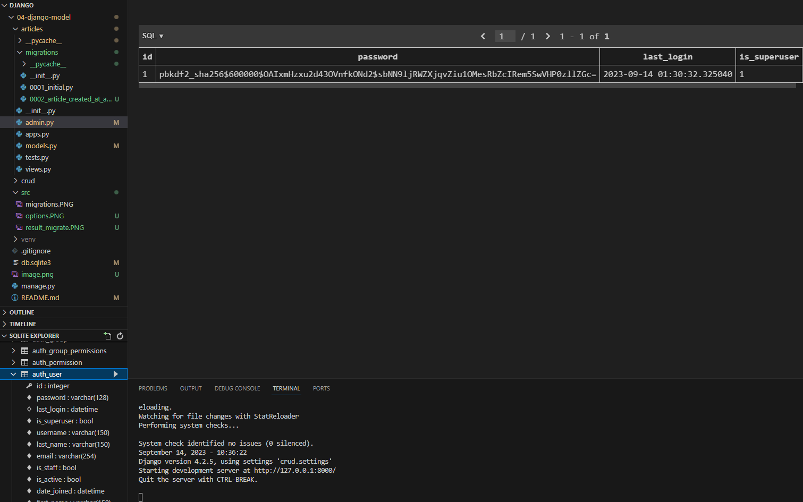
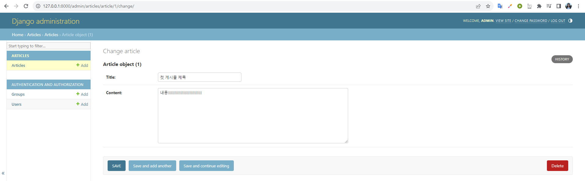
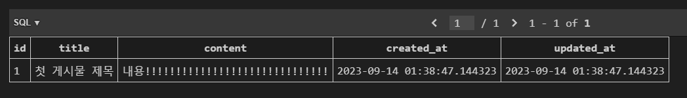
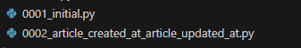
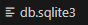
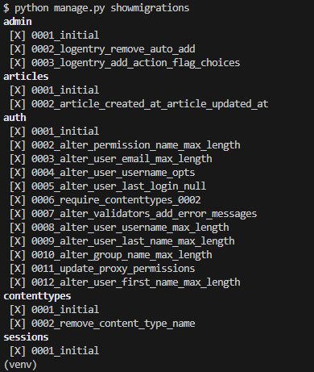
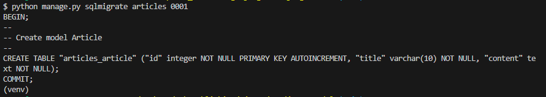

# Django Model
------

## 1. Model

### &rarr; Django Model
- DB의 테이블을 정의하고 데이터를 조작할 수 있는 기능들을 제공
    - 테이블 구조를 설계하는 `청사진`(blueprint)


### &rarr; model 클래스 작성


```python
from django.db import models

class Article(models.Model):
    title = models.CharField(max_length=10)
    content = models.TextField()
```


- 클래스 변수명
: 테이블의 각 필드(열) 이름


- model Field 클래스
    - 테이블 필드의 데이터 타입
    - 키워드 인자(필드 옵션)
        - 테이블 필드의 제약조건 관련 설정
        - ex. (max_length = 10)


### &rarr; model 제약 조건


- 데이터가 올바르게 저장되고 관리되도록 하기 위한 규칙
    - 숫자만 저장되도록, 문자가 100자 까지만 저장되도록 하는 것 등...


## 2. Migrations

### &rarr; Migrations


- model 클래스의 변경사항(필드 생성, 수정, 삭제 등)을 DB에 최종 반영하는 방법


### &rarr; Migrations 과정


1. model class (설계도 초안)
-> make migrations
2. migration 파일 (최종 설계도)
-> migrate
3. db.sqlite3 (DB)





### &rarr; Migrations 핵심 명령어 2가지


1. model class를 기반으로 최종설계도(migration) 작성

```bash
$ python manage.py makemigrations
```


2. 최종 설계도를  DB에 전달하여 반영

```bash
$ python manage.py migrate
```

### &rarr; 이미 생선된 테이블에 필드를 추가해야 하는 상황


1. 추가 모델 필드 작성

```python
class Article(models.Model):
    title = models.CharField(max_length=10)
    content = models.TextField()
    created_at = models.DateTimeField(auto_now_add=True)    # 추가
    updated_at = models.DateTimeField(auto_now=True)        # 추가
```

2. 최종 설계도 작성
    - 이미 기존 테이블이 존재하기 때문에 필드를 추가 할 때 필드의 기본값 설정이 필요
    - 1번은 현재 대화를 유지하면서 직접 기본 값을 입력하는 방법
    - 2번은 현재 대화에서 나간 후 models.py에 기본값 관련 설정을 하는 방법

```bash
$ python manage.py makemigrations
```



    - 추가하는 필드의 기본 값을 입력해야 하는 상황
    - 날짜 데이터이기 때문에 직접 입력하기 본다는 Django가 제안하는 기본 값을 사용하는 것을 권장(1번)
    - 아무것도 입력하지 않고 enter를 누르면 Django가 제안하는 기본값으로 설정됨


3. migrations 과정 종료 후 2번째 migration 파일이 생성됨을 확인
    - django는 설계도를 쌓아가면서 추후 문제가 생겼을 때 복구하거나 되돌릴 수 있도록 함(git commit과 비슷한 역할)


4. migrate 후 테이블 필드 변화 확인

```bash
$ python manage.py migrate
```



▶︎ model class 변경 -> makemigrations -> migrate


### &rarr; Model Field


- DB 테이블의 필드(열)을 정의하며, 해당 필드에 저장되는 데이터 타입과 제약조건을 정의

- CharField()
: 길이의 제한이 있는 문자열을 넣을 때 사용(필드의 최대 길이를 결정하는 max_length는 필수 인자)

- TextField()
: 글자의 수가 많을 때 사용

- DateTimeField()
: 날짜와 시간을 넣을 때 사용
    - 선택 인자(2개)
        - auto_now
        : 데이터가 저장될 때마다 자동으로 현재 날짜 시간을 저장
        - auto_now_add
        : 데이터가 처음 생성될 때만 자동으로 현재 날짜시간을 저장


## 3. Admin Site


### &rarr; Automatic admin interface


- Django는 추가 설치 및 설정 없이 자동으로 관리자 인터페이스를 제공
- 데이터 확인 및 테스트 등을 진행하는데 매우 유용

### &rarr; admin 계정 생성


- email은 선택사항이기 때문에 입력하지 않고 진행 가능ㄹ
- 비밀번호 입력 시 보안상 터미널에 출력되지 않으니 무시하고 입력 이어가기

```bash
$ python manage.py createsuperuser
```

### &rarr; DB에 생성된 admin 계정 확인





### &rarr; admin에 모델 클래스 등록


- articles/admin.py 등록

```python
from django.contrib import admin
from .models import Article

admin.site.register(Article)
```


### &rarr; admin site 로그인 후 등록된 모델 클래스 확인


### &rarr; 데이터 생성, 수정, 삭제 테스트





### &rarr; 테이블 확인





## 4. 참고

### &rarr; 데이터베이스 초기화


- migration 파일 삭제
- db.sqlite3 파일 삭제
- 이 외에 다른 것은 삭제하지 않도록 주의해야 함






### &rarr; Migrations 기타 명령어

1. 

```bash
$ python manage.py showmigrations
```
- migrations 파일들이 migrate 됐는지 안됐는지 여부를 확인하는 명령어
- `[x]` 표시가 있으면 migrate가 완료되었음을 의미
- 결과




2.

```bash
$ python manage.py sqlmigrate articles 0001
```
- 해당 migrations 파일이 SQL 언어(DB에서 사용하는 언어)로 
어떻게 번역되어 DB에 전달되었는지 확인하는 명령
- 결과




### &rarr; 첫 migrate 시 출력 내용이 많은 이유


- Django 프로젝트가 동작하기 위해 미리 작성되어 있는 기본 내장 app들에 대한 migration 파일들이 함께 migrate 되기 때문


### &rarr; SQLite


- 데이터베이스 관리 시스템 중 하나이며 Django의 기본 데이터베이스로 사용됨
- 파일로 존재하며 가볍고 호환성이 좋음


### &rarr; CRUD


- 소프트웨어가 가지는 기본적인 데이터 처리 기능
- Create : 저장
- Read : 조회
- Update : 갱신
- Delete : 삭제