# Django ORM
------

## 1. ORM

### &rarr; `ORM`

- Object-Relational-Mapping
: 객체 지향 프로그램 언어를 사용하여 호환되지 않는 유형의 시스템 간에 데이터를 변환하는 기술


### &rarr; ORM의 역할

- 사용하는 언어가 다르기 때문에 소통이 불가한 상황 해결


    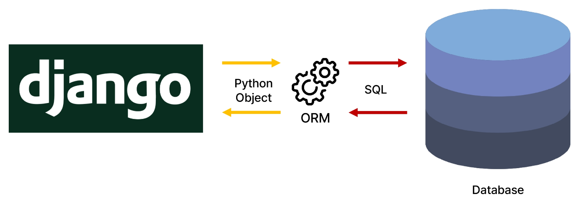


## 2. QuerySet API

### &rarr; `QuerySet API`

- ORM에서 데이터를 검색, 필터링, 정렬 및 그룹화 하는데 사용하는 도구

    ▶︎ API를 사용하여 SQL이 아닌 Python 코드로 데이터를 처리

    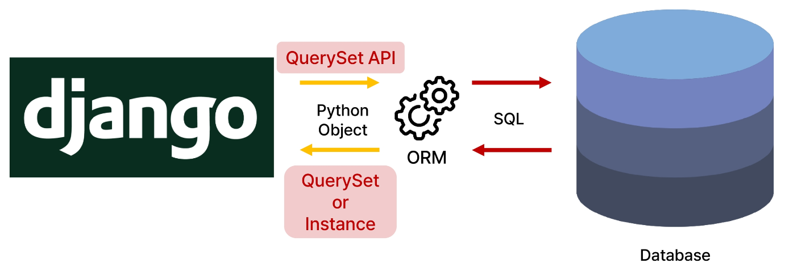


### &rarr; QuerySet API 구문

- Model 클래스의 manager의 메서드 호출(전체 조회)

    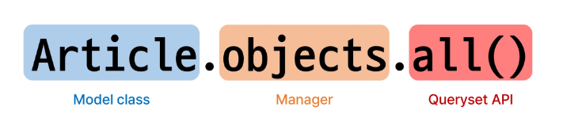


### &rarr; `Query`

- 데이터베이스에 특정한 데이터를 보여 달라는 요청
- 쿼리문을 작성한다.
    - 원하는 데이터를 얻기 위해 데이터베이스에 요청을 보낼 코드를 작성한다.
- 파이썬으로 작성한 코드가 ORM의 의해 SQL로 변환되어 데이터베이스에 전달되며, 데이터베이스의 응답 데이터를 ORM이 QuerySet이라는 자료 형태로 변환하여 우리에게 전달


### &rarr; `QuerySet`

- 데이터베이스에게서 전달 받은 객체 목록(데이터 모음)
    - 순회 가능한 데이터로써 1개 이상의 데이터를 불러와 사용할 수 있음
- Django ORM을 통해 만들어진 자료형
- 단, 데이터베이스가 단일한 객체를 반활할 때는 QuerySet이 아닌 모델(Class)의 인스턴스로 반환됨

▶︎ Python의 `모델 클래스`와 `인스턴스`를 활용해 DB에 데이터를 `저장`, `조회`, `수정`, `삭제`하는 것

## 3. QuerySet API 실습

### &rarr; `Create`

### QuerySet API 실습 사전 준비
- 외부 라이브러리 설치 및 설정

1. 외부 라이브러리 설치

    ```bash
    # python 코드에 색 넣어주는 기능
    $ pip install ipython

    # shell_plus 사용을 하기 위해
    # 자동완성, 기본적인 메서드 import 해주는 기능
    $ pip install django-extensions
    ```


2. INSTALLED_APPS 앱 등록

   - APP 등록 권장 순서
       1. normal app
       2. third party app
       3. django app


3. requirements.txt 업데이트

    ```bash
    $ pip freeze > requirements.txt
    ```


### &rarr; `Django shell`

- Django 환경 안에서 실행되는 python shell
    - 입력하는 QuerySet API 구문이 Django 프로젝트에 영향을 미침


### Django shell 실행

```bash
$ python manage.py shell_plus
```


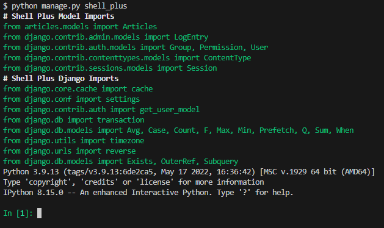


### 데이터 객체를 만드는(생성하는) 3가지 방법

1. 인스턴스 article을 활용하여 인스턴스 변수 활용하기

    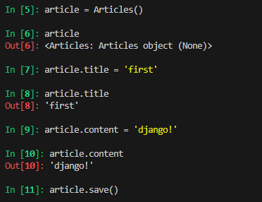

    <br>

    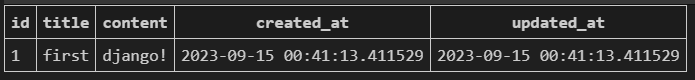


2. 인스턴스 article 생성시 데이터 같이 생성

- 테이블에 한 줄(행, 레코드)이 쓰여진 것

    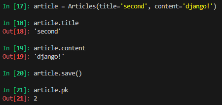
    
    <br>

    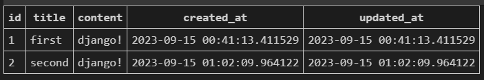

3. QuerySet API 중 create() 메서드 활용

- 위 2가지 방법과 달리 바로 저장 후 바로 생성된 데이터가 반환된다.

    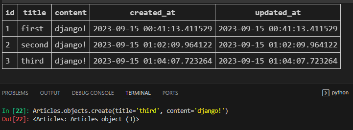


### &rarr; `save()`

- 객체를 데이터베이스에 저장하는 메서드

```python
article.save()
```

### &rarr; `Read`

▶︎ 조회(중요!!)

- `all()`
: 전체 데이터 조회

    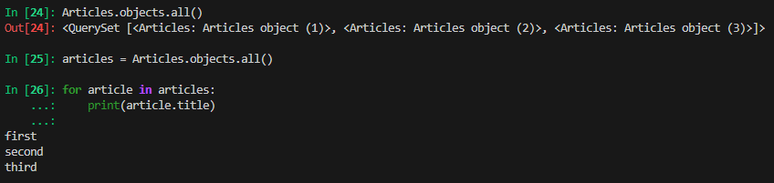


- `get()`
: 단일 데이터 조회
    - get() 특징
        - 객체를 찾을 수 없으면 `DoesNotExist` 예외를 발생시키고,
        둘 이상의 객체를 찾으면 `MultipleObjectsReturned` 예외를 발생시킴
        - 위 같은 특징을 가지고 있기 때문에 primary key와 같이 
        `고유성(uniqueness)`을 보장하는 조회에서 사용해야 함


    ▶︎ pk 값으로 조회

    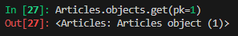
    
    ▶︎ pk 값으로 조회 - pk 범위를 벗어났을 때

    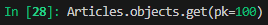

    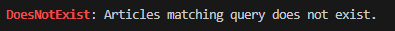


    ▶︎ 데이터 값 조회 - 내용이 같은 레코드가 여러개 존재할 때

    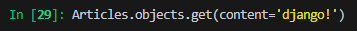

  - get() 메서드는 단일 데이터만 가능하기 때문에 오류 발생

    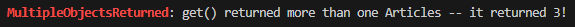


- `filter()`
: 특정 조건 데이터 조회

  1. content가 'django!'인 레코드 3개가 존재하여 QuerySet이 3개가 추출된다.

    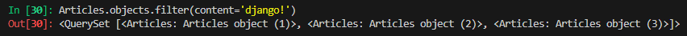

  2. content가 'hello'인 레코드가 존재하지 않으므로 QuerySet이 빈 채로 추출된다.

    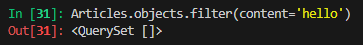

  3. title이 'first'인 레코드 1개가 존재하여 QuerySet이 1개가 추출된다.

    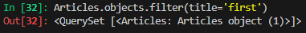


### &rarr; `Update`

- 데이터 수정
: 인스턴스 변수를 변경 후 save 메서드 호출

    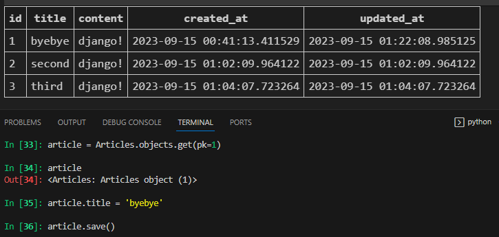


### &rarr; `Delete`

- 데이터 삭제
: 삭제하려는 데이터 조회 후 delete 메서드 호출

    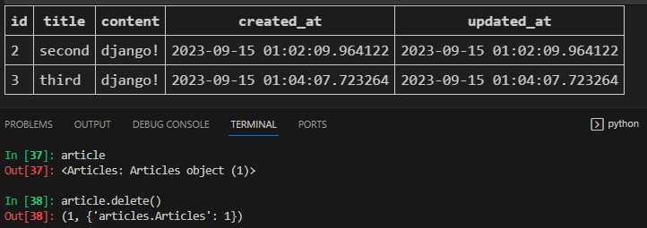


## 4. 참고

### &rarr; Field lookups

- 특정 레코드에 대한 조건을 설정하는 방법
- QuerySet 메서드 filter(), exclude() 및 get()에 대한 키워드 인자로 지정됨

    ```python
    # Field lookups 예시
    # 'content 컬럼에 'dja'가 포함된 모든 데이터 조회

    Articles.objects.filter(content__contains='dja')
    ```

### &rarr; ORM, QuerySet API를 사용하는 이유

- 데이터베이스 쿼리를 추상화하여 Django 개발자가 데이터베이스와 직접 상호작용하지 않아도 되도록 함

- 데이터베이스와의 결합도를 낮추고 개발자가 더욱 직관적이고 생산적으로 개발할 수 있도록 도움


## 5. Next Time

- 유효성 검사
    - max_length를 10으로 지정하였음에도 DB에 입력되는 문제가 발생한다.
    - 이를 해결하기 위해서는 유효성 검사가 필요하다.

    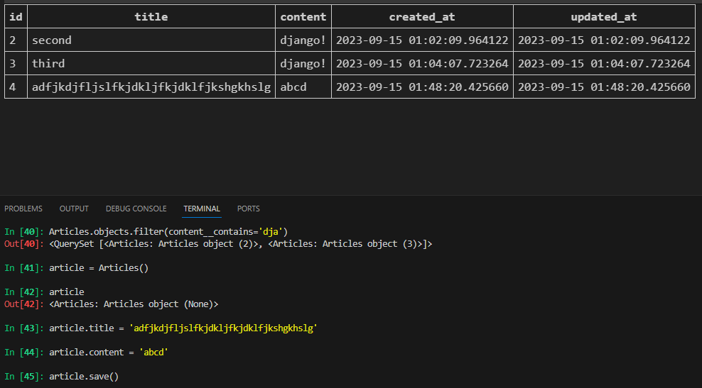

<br>

- DB 불러오기
    - 만들어둔 DB를 불러와 화면에 출력한다.
    - 조회를 통해 DB를 활용한다.

    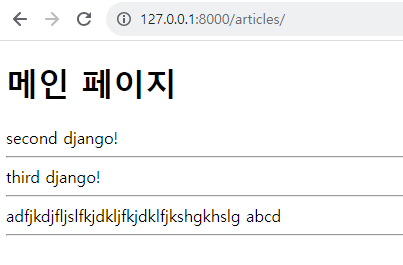