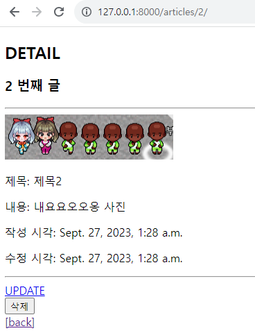

# Django Static files
------

## 1. Static files

### &rarr; static files (정적 파일)

- 서버 측에서 변경되지 않고 고정적으로 제공되는 파일
- 이미지, JS, CSS 파일 등

### &rarr; 웹 서버와 정적 파일

- 웹 서버의 기본 동작은 특정 위치(URL)에 있는 자원을 요청(HTTP request) 받아서 응답(HTTP response)을 처리하고 제공(Serving) 하는 것

- 이는 자원에 접근 가능한 주소가 있다는 의미

- 웹 서버는 요청 받은 URL로 서버에 존재하는 정적 자원을 제공함

--> 정적 파일을 제공하기 위한 경로(URL)가 있어야 함

### &rarr; static files 제공하기

1. 기본 경로에서 제공하기

2. 추가 경로에서 제공하기

### &rarr; static files 기본 경로

- app폴더/static/

--------

## 2. Media files

### &rarr; 이미지 업로드

### &rarr; 업로드 이미지 제공

