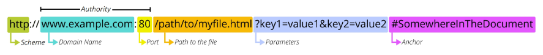

# Django REST framework 1

----

## 1. REST API

### &rarr; API

- API(Application Programming Interface)
  - 애플리케이션과 프로그래밍으로 소통하는 방법
  - 클라이언트-서버처럼 서로 다른 프로그램에서 요청과 응답을 받을 수 있도록 만든 체계
  - 복잡한 코드를 추상화하여 대신 사용할 수 있는 몇 가지 더 쉬운 구문을 제공

### &rarr; Web API

- 웹 서버 또는 웹 브라우저를 위한 API
- 현대 웹 개발은 하나부터 열까지 직접 개발하기보다 여러 OpenAPI들을 활용하는 추세
- 대표적인 Third Party Open API 서비스 목록
  - Youtube API
  - Google Map API
  - Naver Papago API
  - Kakao Map API

### &rarr; REST

- REST(Representational State Transfer)
  - API Server를 개발하기 위한 일종의 소프트웨어 설계 방법론(약속)

### &rarr; RESTful API

- REST 원리를 따르는 시스템을 RESTful 하다고 부름
- "자원을 정의"하고 "자원에 대한 주소를 지정"하는 전반적인 방법을 서술

### &rarr; REST API

: REST라는 설계 디자인 약속을 지켜 구현한 API

### &rarr; REST에서 자원을 정의하고 주소를 지정하는 방법

1. 자원의 식별
  - URI

2. 자원의 행위
  - HTTP Methods

3. 자원의 표현
  - JSON 데이터
  - 데이터 결과물

### &rarr; 자원의 식별

1. URI (Uniform Resource Identifier)
: 통합 자원 식별자
- 인터넷에서 리소스를 식별하는 문자열
- 가장 일반적인 URI는 웹 주소로 알려진 URL

2. URL (Uniform Resource Locator)
: 통합 자원 위치
- 웹에서 주어진 리소스의 주소
- 네트워크 상에 리소스가 어디 있는지를 알려주기 위한 약속

### &rarr; URL 구성

1. Schema (or Protocol)
- 브라우저가 리소스를 요청하는 데 사용해야 하는 규약
- URL의 첫 부분은 브라우저가 어떤 규약을 사용하는지를 나타냄
- 기본적으로 웹은 HTTP(S)를 요구하며 메일을 열기 위한 mailto:, 파일을 전송하기 위한 ftp: 등 다른 프로토콜도 존재

2. Domain Name
- 요청 중인 웹 서버를 나타냄
- 어떤 웹 서버가 요구되는지를 가르키며 직접 IP 주소를 사용하는 것도 가능하지만, 사람이 외우기 어렵기 때문에 주로 Domain Name으로 사용
- 예를 들어 도메인 google.com의 IP 주소는 142.251.42.142

3. Port
- 웹 서버의 리소스에 접근하는데 사용되는 기술적인 문(Gate)
- HTTP 프로토콜의 표준 포트
  - HTTP - 80
  - HTTPS - 443
- 표준 포트만 생략 가능

4. Path

5. Parameters

6. Anchor

### &rarr; 자원의 행위

- HTTP Request Methods
  1. GET
  2. POST
  3. PUT
  4. DELETE

- HTTP request status codes
  - Informational responses(100-199) 

### &rarr; 자원의 표현

----
## 2. DRF

### &rarr; Django REST framework

- Django에서 Restful API 서버를 쉽게 구축할 수 있도록 도와주는 오픈소스 라이브러리

### &rarr; Serialization
: 직렬화

- 여러 시스템에서 활용하기 위해 데이터 구조나 객체 상태를 나중에 재구성할 수 있는 포맷으로 변환하는 과정

- 어떠한 언어나 환경에서도 나중에 다시 쉽게 사용할 수 있는 포맷으로 변환하는 과정

------
## 3. DRF with Single Model

### &rarr; Postman

### &rarr; GET

### &rarr; POST

### &rarr; 