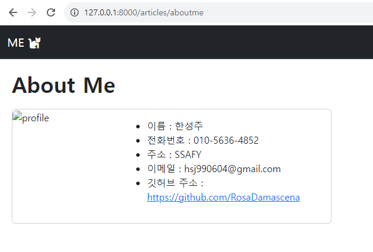
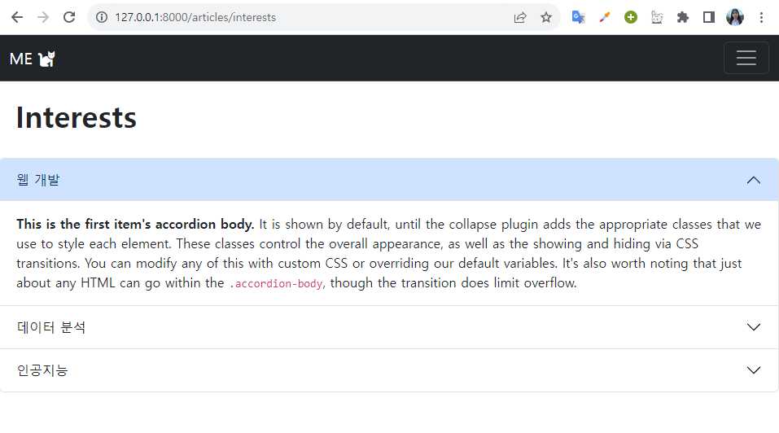
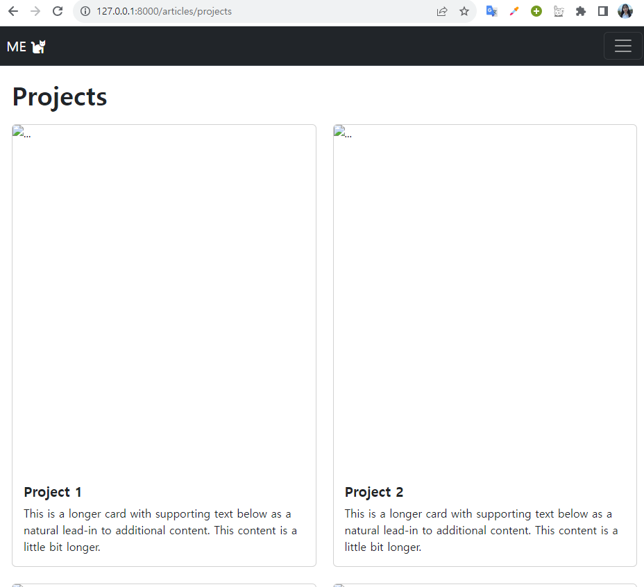
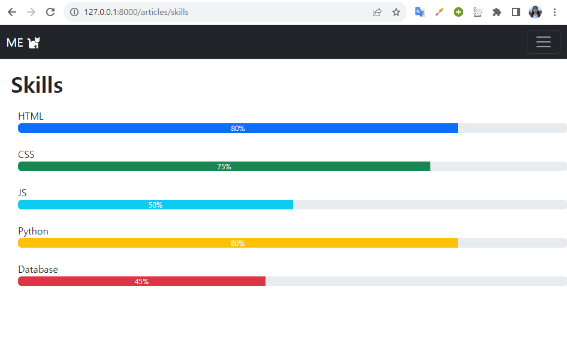

# Django를 활용하여 미리 만들어준 포트폴리오 서버로 불러오기
--------

## &rarr; About Me
- About Me 페이지 불러오기
- result/AboutMe.html 연결

 

## &rarr; Interests
- Interests 페이지 불러오기
- result/Interests.html 연결

 

## &rarr; Projects
- Projects 페이지 불러오기
- result/Projects.html 연결

 

## &rarr; Skills
- Skills 페이지 불러오기
- result/Skills.html 연결

