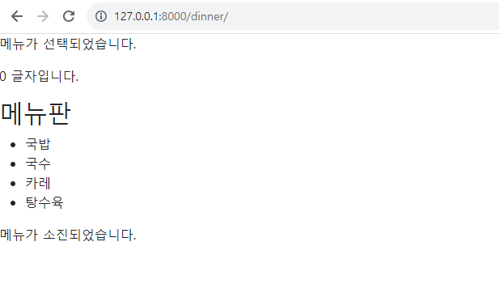
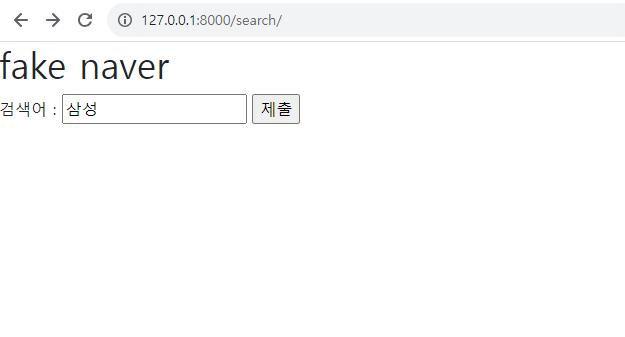
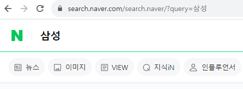
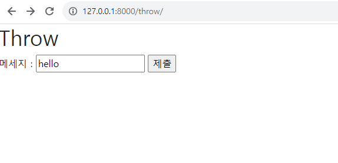
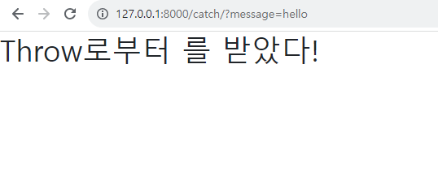
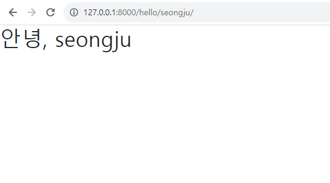
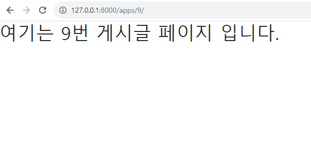

# Django 실습 1
------

## &rarr; practice 1
- /dinner/ 경로로 연결되었을 때 저녁 메뉴판이 나오도록 하기
- apps/dinner.html 연결

## &rarr; practice 2
- /search/ 경로로 연결되었을 때 검색어 입력 시 실제네이버 검색창 연결
- apps/search.html 연결

 
 

## &rarr; practice 3
- /throw/ 경로로 연결되었을 때 메세지 입력창 연결
- 메세지 입력 창인 apps/throw.html 연결
- 메세지 입력 후 제출시 결과인 apps/catch.html 연결

 
 

## &rarr; practice 4
- /hello/<name>/ 경로 연결 시 hello, <name> 출력 페이지
- apps/greeting.html 연결

 

## &rarr; practice 5
- /apps/<int:num>/ 경로일 때 num번 게시글 페이지 연결
- apps/detail.html 연결

