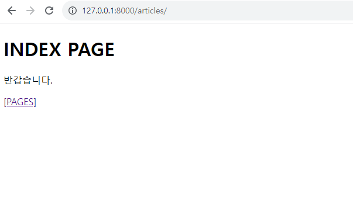
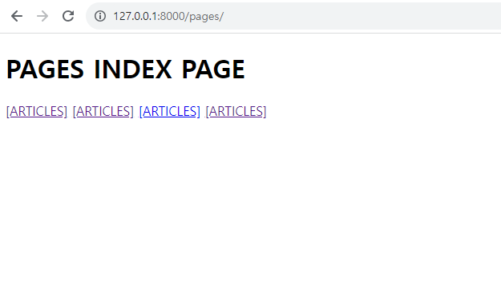
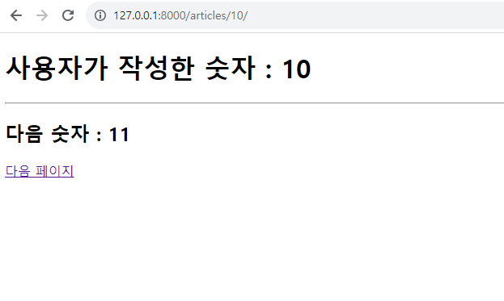

# Django 실습 2
------

## &rarr; practice 1
- /article/ 경로로 연결되었을 때 pages/index.html 열기

## &rarr; practice 2
- /pages/ 경로로 연결되었을 때 pages/index.html 열기
- 같은 파일을 여러 url 방식으로 표현하기

## &rarr; practice 3
- /articles/<int:number>/ 경로일 때 articles/random_number.html 열기
- 다음페이지 버튼을 눌렀을 때 숫자가 1씩 증가하는 페이지 만들기

