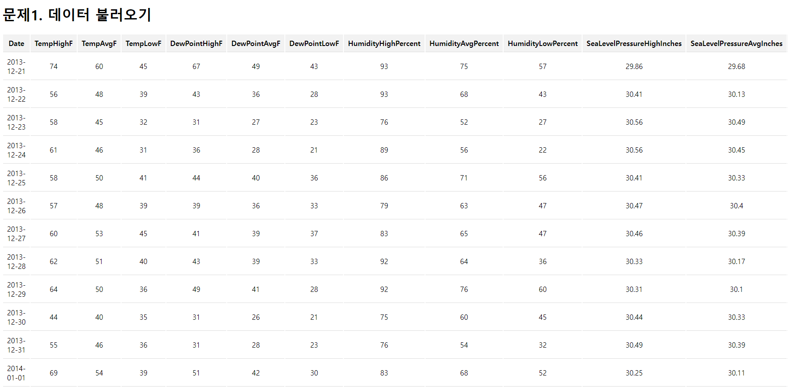

# 04_pjt
-----

## A. base.html

- 공통 부모 템플릿
  - 모든 템플릿 파일은 base.html 을 상속받아 사용합니다.
  - 다른 파일 템플릿 경로로 이동할 수 있는 링크들을 출력합니다.

```html
<!-- base.html -->
<!DOCTYPE html>
<html lang="en">
<head>
    <meta charset="UTF-8">
    <meta name="viewport" content="width=device-width, initial-scale=1.0">
    <title>Base</title>
    <style>
        
        
    </style>
</head>
<body>
    <a href="">문제1 | </a>
    <a href="">문제2 | </a>
    <a href="">문제3 | </a>
    <a href="">문제4</a>
    <hr>
    
    
</body>
</html>
```

### 출력 결과


## B. problem1.html

- Pandas 를 사용하여 캐글에서 다운로드 받은 파일을 DataFrame 으로 읽어옵니다.
- 제공된 스타일을 활용하여 전체 데이터를 표 형태로 출력합니다.

```html
<!-- problem1.html -->



    th {
        background-color: #f2f2f2;
    }
    th, td {
        padding: 9px;
        border-bottom : 1px solid #ddd;
    }
    table {
        text-align: center;
    }



    <h1>문제1. 데이터 불러오기</h1>
    <table>
        <tr>
            
                <th>
                    {{ column }}
                </th>
            
        </tr>
        
            <tr>
                
                    <td>
                        {{ value }}
                    </td>
                
            </tr>
        
    </table>

```
```python
# weathers/views.py
csv_path = 'weathers/data/austin_weather.csv'

def problem1(request):
    df = pd.read_csv(csv_path)
    context = {
        'df': df
    }
    return render(request, 'weathers/problem1.html', context)
```

### 출력 결과




## C. problem2.html
- 일 별 최고, 평균, 최저 온도를 선 그래프로 출력합니다.
- 날짜 필드: 날짜 형식으로 변환하여 사용합니다.

```python
# weathers/views.py
def problem2(request):
    df = pd.read_csv(csv_path)
    df['Date'] = pd.to_datetime(df['Date'])
    df_2014 = df[df['Date'] >= '2014-01-01']
    x_value = df_2014['Date']
    xtick_labels = df_2014['Date'].dt.strftime('%Y-%m')
    
    plt.clf()

    plt.figure(figsize=(10, 6))

    plt.plot(x_value, df_2014['TempHighF'], label='High Temperature')
    plt.plot(x_value, df_2014['TempAvgF'], label='Average Temperature')
    plt.plot(x_value, df_2014['TempLowF'], label='Low Temperature')

    plt.title("Temperature Variation")

    plt.ylabel('Temperature (Fahrenheit)')
    plt.xlabel('Date')

    plt.legend(loc='lower center')
    plt.grid()

    plt.xticks(x_value.iloc[::len(x_value)//7], xtick_labels.iloc[::len(xtick_labels)//7])

  
    buffer = BytesIO()
    plt.savefig(buffer, format='png')
    image_base64 = base64.b64encode(buffer.getvalue()).decode('utf-8').replace('\n', '')

    buffer.close()

    context = {
        'chart_image2': f'data:image/png;base64,{image_base64}',
    }

    return render(request, 'weathers/problem2.html', context)

```

### 출력 결과


## D. problem3.html
- 월 별 최고, 평균, 최저 온도의 평균을 선 그래프로 시각화 합니다
- 날짜 필드: 날짜 형식으로 변환하여 사용합니다.
- 온도 필드: 평균값 계산을 위해 숫자 형식으로 변환하여 사용합니다.

```python
# weathers/views.py
def problem3(request):
    df = pd.read_csv(csv_path)
    df['Date'] = pd.to_datetime(df['Date'])
    df_2014 = df[df['Date'] >= '2014-01-01']
    monthly_avg = df_2014.groupby(df_2014['Date'].dt.strftime('%Y-%m'))[['TempHighF', 'TempAvgF', 'TempLowF']].mean()

    plt.clf()
    plt.figure(figsize=(10, 6))

    x_value = monthly_avg.index 
    plt.plot(x_value, monthly_avg['TempHighF'], label='Monthly High Temperature Avg')
    plt.plot(x_value, monthly_avg['TempAvgF'], label='Monthly Average Temperature Avg')
    plt.plot(x_value, monthly_avg['TempLowF'], label='Monthly Low Temperature Avg')

    plt.title("Temperature Variation")
    plt.ylabel('Temperature (Fahrenheit)')
    plt.xlabel('Date')

    plt.legend(loc='lower right')
    plt.grid()

    plt.xticks(x_value[::len(x_value)//7])

    buffer = BytesIO()
    plt.savefig(buffer, format='png')
    image_base64 = base64.b64encode(buffer.getvalue()).decode('utf-8').replace('\n', '')

    buffer.close()

    context = {
        'chart_image3': f'data:image/png;base64,{image_base64}',
    }

    return render(request, 'weathers/problem3.html', context)
```


### 출력 결과


## E. problem4.html
- 기상 현상의 발생 횟수(“Events” 컬럼)를 히스토그램으로 출력합니다.
- 사용되는 Events 컬럼은 “결측치” 가 포함되어 있으며, “다중 값을 허용” 합니다.
- 다중 값은 각 기상 현상의 발생 횟수에 추가하여 계산합니다.
- ex. “Rain , Thunderstorm” = “Rain + 1, Thunderstorm + 1” 로 계산합니다.

```python
# weathers/views.py
def problem4(request):
    df = pd.read_csv(csv_path)

    df['Events'] = df['Events'].replace(' ', 'No Event')

    event_counts = df['Events'].str.split(' , ').explode().value_counts()

    event_mapping = {event: idx for idx, event in enumerate(event_counts.index)}

    event_values = list(event_mapping.values())
    event_labels = list(event_mapping.keys())

    plt.clf()

    plt.figure(figsize=(10, 6))

    plt.bar(event_values, event_counts.values)
    plt.xticks(event_values, event_labels)
    plt.xlabel('Events')
    plt.ylabel('Count')
    plt.title('Weather Event Counts')
    plt.grid()

    buffer = BytesIO()

    plt.savefig(buffer, format='png')

    image_base64 = base64.b64encode(buffer.getvalue()).decode('utf-8').replace('\n', '')

    buffer.close()

    context = {
        'chart_image4': f'data:image/png;base64,{image_base64}',
    }

    return render(request, 'weathers/problem4.html', context)
```

### 출력 결과

