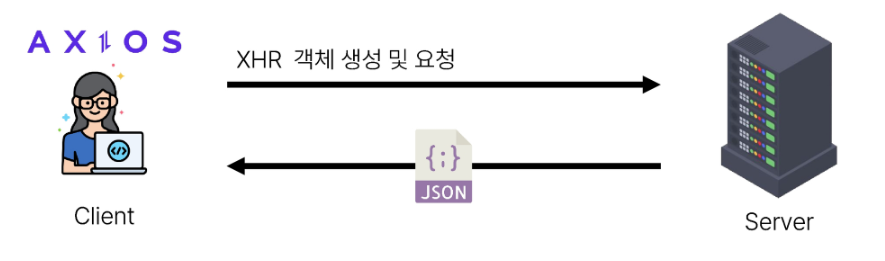

# Ajax with Django

-----

## 1. Ajax와 서버

### Ajax

- Asynchronous JavaScript + XML/JSON
- JS의 비동기 구조와 XML 객체를 활용해 비동기적 서버와 통신하여 웹 페이지의 일부분만을 업데이트 하는 웹 개발 기술

### Ajax를 활용한 클라이언트 서버 간 동작

- 클라이언트 / 서버
- 이벤트 발생 -> XML 객체 생성 및 요청 -> Ajax 요청 처리 -> 응답 데이터 생성 -> JSON 데이터 응답 -> 응답 데이터를 활용해 DOM 조작(웹 페이지의 일부분만을 다시 로딩)

------

## 2. Ajax with follow

-----

## 3. Ajax with likes