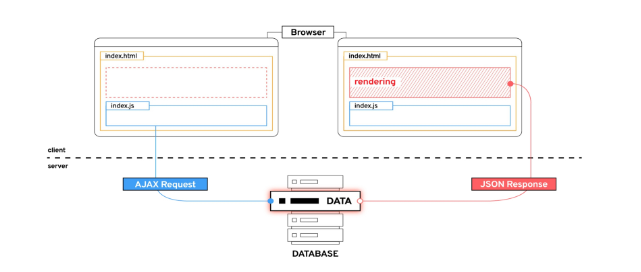

# Introduction of Vue

-----

## 1. Front-end Development

### Front-end Development

- 웹사이트와 웹 애플리케이션의 사용자 인터페이스(UI)와 사용자 경험(UX)을 만들고 디자인하는 것
- HTML, CSS, JavaScript 등을 활용하여 사용자가 직접 상호작용하는 부분을 개발

### Client-side frameworks

- 클라이언트 측에서 UI와 상호작용을 개발하기 위해 사용되는 JS 기반 프레임워크

- Vue, React, Angular

### Client-side frameworks가 필요한 이유

1. 웹에서 하는 일이 많아짐
- 단순히 무언가를 읽는 곳 -> 무언가를 하는 곳
- 사용자는 이제 웹에서 음악을 스트리밍 하고 영화를 보고 원거리에 있는 사람들과 텍스트 및 영상 채팅을 통해 즉시 통신하고 있음
- 웹 애플리케이션 -> 대화형 웹 사이트
- js 기반의 Client-side frameworks 출현으로 동적인 대화형 애플리케이션 구축 가능

2. 다루는 데이터가 많아짐
- 애플리케이션의 상태를 변경할 때마다 일치하도록 UI를 업데이트 해야 함
- 애플리케이션의 기본 데이터를 안정적으로 추적하고 업데이트(렌더링, 추가, 삭제 등)하는 도구가 필요


### SPA (Single Page Application)

- 페이지 한 개로 구성된 웹 애플리케이션
- 웹 애플리케이션의 초기 로딩 후 새로운 페이지 요청 없이 동적으로 화면을 갱신하며 사용자와 상호작용하는 웹 애플리케이션
- CSR 방식


1. 서버로부터 필요한 모든 정적 HTML을 처음에 한 번 가져옴
2. 브라우저가 페이지를 로드하면 Vue 프레임워크는 각 HTML 요소에 적절한 JS 코드를 실행(이벤트에 응갑, 데이터 요청 후 UI 업데이트 등)


### CSR(Client-side Rendering)

1. 브라우저는 페이지에 필요한 최소한의 HTML 페이지와 JS를 다운로드
2. JS를 사용하여 DOM을 업데이트하고 페이지를 렌더링




### CSR 장점

1. 빠른 속도
- 페이지의 일부를 다시 렌더링 할 수 있으므로 동일한 웹 사이트의 다른 페이지로 이동하는 것이 일반적으로 더 빠름
- 서버로 전송되는 데이터의 양을 최소화

2. 사용자 경험
- 새록고침이 발생하지 않아 네이티브 앱과 유사한 사용자 경험을 제공

3. Front-end와 Back-end의 명확한 분리
- Front-end는 UI 렌도링 및 사용자 상호 작용 처리를 담당
- Back-end는 데이터 및 API 제공을 담당
- 대규모 애플리케이션을 더 쉽게 개발하고 유지 관리 가능


### CSR 단점

1. 초기 구동 속도가 느림
- 전체 페이지를 보기 전에 약간의 지연을 느낄 수 있음
- JS가 다운로드, 구문 분석 및 실행될 때마다 페이지가 완전히 렌더링 되지 않기 때문

2. SEO(검색 엔진 최적화) 문제
- 페이지를 나중에 그려 나가는 것이기 때문에 검색에 잘 노출되지 않을 수 있음


------

## 2. Vue

### Vue

- 사용자 인터페이스를 구축하기 위한 JavaScript 프레임워크

### Vue를 학습하는 이유

1. 쉬운 학습 곡선 및 간편한 문법

2. 반응성 시스템
- 데이터 변경에 따라 자동으로 화면이 업데이트 되는 기능을 제공

3. 모듈화 및 유연한 구조
- 애플리케이션을 컴포넌트 조각으로 나눌 수 있음
- 코드의 재사용성을 높이고 유지보수를 용이하게 함


### Vue의 2가지 핵심 기능

1. 선언적 렌더링(Declarative Rendering)
- HTML을 확장하는 템플릿 구문을 사용하여 HTML이 JavaScript 데이터를 기반으로 어떻게 보이는지 설명할 수 있음

2. 반응형(Reactivity)
- JavaScript 상태 변경사항을 자동으로 추적하고 변경사항이 발생할 때 DOM을 효율적으로 업데이트

### Vue를 사용하는 방법

1. CDN 방식

```html
<script src="https://unpkg.com/vue@3/dist/vue.global.js"></script>
```

2. NPM 설치 방식

```bash
npm init vue@latest
```

```bash
cd <your-project-name>
npm install
npm run dev
npm run build
```

### Application instance

- 모든 Vue 애플리케이션은 createApp 함수로 새 Application instance를 생성하는 것으로 시작


### app.mount()

- 컨테이너 요소에 애플리케이션 인스턴스를 탑재(연결)
- 각 앱 인스턴스에 대해 mount()는 한 번만 호출할 수 있음


### ref()

- 반응형 상태(데이터)를 선언하는 함수
- Declaring Reactive State
- 인자를 받아 .value 속성이 있는 ref 객체로 wrapping하여 반환
- ref로 선언된 변수의 값이 변경되면, 해당 값을 사용하는 템플릿에서 자동 업데이트
- 인자는 어떠한 타입도 가능
- 템플릿의 참조에 접근하려면 setup 함수에서 선언 및 반환 필요
- 템플릿에서 ref를 사용할 때는 .value를 작성할 필요 없음(automatically unwrapped)


### Vue 기본 구조

- createApp()에 전달되는 객체는 Vue 컴포넌트(Component)
- 컴포넌트의 상태는 setup() 함수 내에서 선언되어야 하며 객체를 반환해야 함


### 템플릿 렌더링

- 반환된 객체의 속성은 템플릿에서 사용할 수 있음
- Mustache systax(콧수염 구문)를 사용하여 메세지 값을 기반으로 동적 텍스트를 렌더링
- 콘텐츠는 식별자나 경로에만 국한되지 않으며 유효한 JavaScript 표현식을 사용할 수 있음

### Event Listeners in Vue

- 'v-on' directive를 사용하여 DOM 이벤트를 수신할 수 있음
- 함수 내에서 refs를 변경하여 구성 요소 상태를 업데이트

### Ref Unwrap 주의사항

- 템플릿에서의 unwrap은 ref가 최상위 속성인 경우에만 적용가능

```js
const object = { id: ref(0) }
{{ object.id + 1 }}
// [object Object]1
```

- object는 최상위 속성이지만 object.id는 그렇지 않음
- 표현식을 평가할 때 object.id가 unwrap 되지 않고 ref 객체로 남아 있기 때문
- 이 문제를 해결하기 위해서는 id를 최상위 속성으로 분해 해야 함
  
```js
const { id } = object
{{ id + 1 }}
// 1
```

- 단, ref가 {{ }}의 최종 평가 값인 경우는 unwrap 가능

```js
{{ object.id }}
// 0
{{ object.id.value }} // 동일
```

### Refs를 쓰는 이유

- 일반 변수 대신 굳이 .value가 포함된 ref가 필요한 이유
  - Vue는 템플릿에서 ref를 사용하여 나중에 ref의 값을 변경하면 자동으로 변경 사항을 감지하고 그에 따라 DOM을 업데이트 함(의존성 추적 기반의 반응형 시스템)
  - Vue는 렌더링 중에 사용된 모든 ref를 추적하며, 나중에 ref가 변경되면 이를 추적하는 구성 요소에 대해 다시 렌더링
  - js에서는 일반 변수의 접근 또는 변형을 감지할 방법이 없기 때문


### SEO (Search Engine Optimization)

- google, bing과 같은 검색 엔진 등에 서비스나 제품 등이 효율적으로 검색 엔진에 노출되도록 개선하는 과정을 일컫는 작업
- 정보의 대상은 주로 HTML에 작성된 내용
- 검색
  - 각 사이트가 운용하는 검색 엔진에 의해 이루어지는 작업
- 검색 엔진
  - 웹 상에 존재하는 가능한 모든 정보들을 긁어 모으는 방식으로 동작
- 최근에는 SPA, 즉 CSR로 구성된 서비스의 비중이 증가
- SPA 서비스도 검색 대상으로 넓히기 위해 JS를 지원하는 방식으로 발전하는 중

### CSR & SSR

- CSR과 SSR은 흑과 백이 아님
  - 서비스에 적합한 렌더링 방식을 적절하게 활용할 수 있어야 함

- SPA 서비스에서도 SSR을 지원하는 Framework가 발전하고 있음
  - Vue의 Nuxt.js
  - React의 Next.js
  - Angular의 Universal