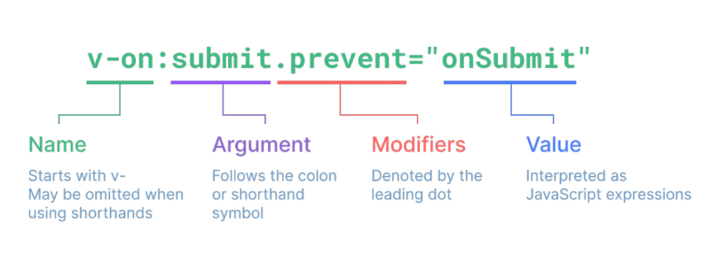
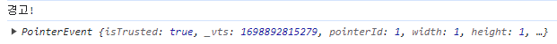

# Basic Syntax

----

## 1. Template Syntax

### Template Syntax

- DOM을 기본 구성 요소 인스턴스의 데이터에 선언적으로 바인딩 할 수 있는 HTML 기반 템플릿 구문을 사용

### Template Syntax 종류

#### 1-1. Text Interpolation

```html
<p>Message : {{ msg }}</p>
```

- 데이터 바인딩의 가장 기본적인 형태
- 이중 중괄호 구문 (콧수염 구문)을 활용
- 콧수염 구문은 해당 구성 요소 인스턴스의 msg의 속성 값으로 대체
- msg 속성이 변경될 때마다 업데이트 됨

#### 1-2. Raw HTML

```html
<div v-html="rawHtml"></div>
<script>
const rawHtml = ref('<span style="color:red">This should be red.</span>')
</script>
```

- 콧수염 구문은 데이터를 일반 텍스트로 해석하기 때문에
- 실제 HTML을 출력하려면 v-html을 사용해야 함

#### 1-3. Attribute Bindings

```html
<div v-bind:id="dynamicId"></div>

const dynamicId = ref('my-id')
```

#### 1-4. JavaScript Expressions


### Directive

- 'v-' 접두사가 있는 특수 속성

### Directive 특징

- Directive의 속성 값은 단일 JavaScript 표현식이어야 함(v-for, v-on 제외)
- 표현식 값이 변경될 때 DOM에 반응적으로 업데이트를 적용
- 예시
  - v-if는 seen 표현식 값의 T/F를 기반으로 <p>  요소를 제거/삽입

```html
<p v-if="seen">Hi There</p>
```

### Directive 전체 구문



### Directive - Arguments

- 일부 directive는 directive 뒤에 콜론(:)으로 표시되는 인자를 사용할 수 있음
- 예시
  - href는 HTML a 요소의 href 속성 값을 myUrl 값에 바인딩 하도록 하는 v-bind의 인자

```html
<a v-binf:href="muUrl">Link</a>
```

- 예시
  - click은 이벤트 수신할 이벤트 이름을 작성하는 v-on의 인자


```html
<a v-on:click="doSomething">Button</a>
```

### Directive - Modifiers

- .(dot)로 표시되는 특수 접미사로, directive가 특별한 방식으로 바인딩되어야 함을 나타냄

- 예시
  - .prevent는 발생한 이벤트에서 event.preventDefault()를 호출하도록 v-on에 지시하는 modifier

```html
<form @submit.prevent="onSubmit">...</form>
```

### Built-in Directives

- v-text
- v-show
- v-if
- v-for
- ...

-----

## 2. Dynamically data binding

### v-bind

- 하나 이상의 속성 또는 컴포넌트 데이터를 표현식에 동적으로 바인딩

### v-bind 사용처

1. Attribute Bindings

2. Class and Style Bindings

### Attribute Bindings

- HTML의 속성 값을 Vue의 상태 속성 값과 동기화 되도록 함

```html

<a v-bind:href="myUrl">Move to url</a>
```

- v-bind shorthand(약어)
  - ':'(colon)

```html

<a :href="myUrl">Move to url</a>
```

- Dynamic attribute name(동적 인자 이름)
  - 대괄호로 감싸서 directive argument에 JavaScript 표현식을 사용할 수도 있음
  - JavaScript 표현식에 따라 동적으로 평가된 값이 최종 argument 값으로 사용됨
  - 대괄호 안에 작성하는 이름은 반드시 소문자로만 구성 가능(브라우저가 속성 이름을 소문자로 강제 변환)

```html
<button :[key]="myValue"></button>
```

### Class and Style Bindings

- 클래스와 스타일 모두 속성이므로 v-bind를 사용하여 다른 속성과 마찬가지로 동적을로 문자열 값을 할당할 수 있음

- 그러나 단순히 문자열 연결을 사용하여 이러한 값을 생성하는 것은 번거롭고 오류가 발생하기가 쉬움

- Vue는 클래스 및 스타일과 함께 v-bind를 사용할 때 객체 또는 배열을 활용한 개선 사항을 제공

### Class and Style Bindings가 가능한 경우

1. Binding HTML Classes
  - 1.1 Binding to Objects
  - 1.2 Binding to Arrays

2. Binding Inline Style
  - 2.1 Binding to Objects
  - 2.2 Binding to Arrays


### Binding HTML Classes 

```html
<body>
  <div id="app">
    <!-- Binding to Objects -->
    <div :class="{ active: isActive }">Text</div>
    <div class="static" :class="{ active: isActive, 'text-primary': hasInfo }">Text</div>
    <div class="static" :class="classObj">Text</div>

    <!-- Binding to Arrays -->
    <div :class="[activeClass, infoClass]">Text</div>
    <div :class="[{active: isActive}, infoClass]">Text</div>
  </div>

  <script src="https://unpkg.com/vue@3/dist/vue.global.js"></script>
  <script>
    const { createApp, ref } = Vue

    const app = createApp({
      setup() {
        const isActive = ref(false)
        const hasInfo = ref(true)
        const classObj = ref({
          active: isActive, 
          'text-primary': hasInfo
        })
        const activeClass = ref('active')
        const infoClass = ref('text-primary')

        return {
          isActive,
          hasInfo,
          classObj,
          activeClass,
          infoClass,
        }
      }
    })

    app.mount('#app')
  </script>
</body>
```


### Binding Inline Style

```html
<body>
  <div id="app">
    <!-- Binding to Objects -->
    <div :style="{ color: activeColor, fontSize: fontSize + 'px'}">Text</div>
    <div :style="{ 'fontSize': fontSize + 'px'}">Text</div>
    <div :style="styleObj">Text</div>
    

    <!-- Binding to Arrays -->
    <div :style="[styleObj, styleObj2]">Text</div>
  </div>

  <script src="https://unpkg.com/vue@3/dist/vue.global.js"></script>
  <script>
    const { createApp, ref } = Vue

    const app = createApp({
      setup() {
        const activeColor = ref('crimson')
        const fontSize = ref(50)
        const styleObj = ref({
          color: activeColor,
          fontSize: fontSize.value + 'px',
        })
        const styleObj2 = ref({
          color: 'blue',
          border: '1px solid black',
        })
        return {
          activeColor,
          fontSize,
          styleObj,
          styleObj2
        }
      }
    })

    app.mount('#app')
  </script>
</body>
```


-----

## 3. Event Handling

### v-on

- DOM 요소에 이벤트 리스너를 연결 및 수신

### v-on 구성

```js
v-on:event="handler"
```

- handler 종류
  - Inline handlers : 이벤트가 트리거 될 때 실행될 JavaScript 코드
  - Method handlers : 컴포넌트에 정의된 메서드 이름

- v-on shorthand(약어)
  - '@'

```js
@event="handler"
```

### Inline handlers

- Inline handlers는 주로 간단한 상황에 사용

```html
<!-- Inline Handlers -->
<button @click="count++">Add 1</button>
<p>Count: {{ count }}</p>

const count = ref(0)
```

### Method Handlers

- Inline handlers로는 불가능한 대부분의 상황에서 사용


```html
<!-- Method Handlers -->
<button @click="myFunc">Hello</button>

const name = ref('Alice')
const myFunc = function (event) {
  console.log(event)
  console.log(event.currentTarget)
  console.log(`Hello ${name.value}!`)
}
```

### Inline Handlers 에서의 메서드 호출

- 메서드 이름에 직접 바인딩 하는 대신 Inline Handlers에서 메서드를 호출할 수도 있음
- 기본 이벤트 대신 사용자 지정 인자를 전달할 수 있음

```html
<!-- Calling Methods in Inline Handlers -->
<button @click="greeting('Hello')">Say hello</button>
<button @click="greeting('Bye~')">Say bye</button>

const greeting = function (message) {
  console.log(message)
}
```

### Inline Handlers 에서의 event 인자에 접근하기

- inline Handlers에서 원래 DOM 이벤트 접근하기
- $event 변수를 사용하여 메서드에 전달

```html
<!-- Accessing Event Argument in Inline Handlers -->
<button @click="warning('경고!', $event)">Submit</button>

const warning = function (message, event) {
  console.log(message)
  console.log(event)
}
```



### Event Modifiers

- Vue는 v-on에 대한 Event Modifiers를 제공해 event.preventDefault()와 같은 구문을 메서드에서 작성하지 않도록 함
- stop, prevent, self 등 다양한 modifiers를 제공
- 메서드는 DOM 이벤트에 대한 처리보다는 데이터에 관한 논리를 작성하는 것에 집중할 것
- Modifiers는 chained 되게끔 작성할 수 있으며 이때는 작성된 순서로 실행되기 때문에 작성 순서에 유의

```html
<!-- event modifiers -->
<form @submit.prevent="onSubmit">
  <input type="submit">
</form>
<a @click.stop.prevent="onLink">Link</a>
```

### key modifiers

- Vue는 키보드 이벤트를 수신할 때 특정 키에 관한 별도 modifiers를 사용할 수 있음
- 예시
  - key가 Enter일 때만 onSubmit 이벤트를 호출하기

```html
<!-- key modifiers -->
<input @keyup.enter="onSubmit">
```

-----

## 4. Form Input Bindings

### Form Input Bindings

- form을 처리할 때 사용자가 input에 입력하는 값을 실시간으로 JavaScript 상태에 동기화 해야 하는 경우(양방향 바인딩)

- 양방향 바인딩 방법
  - 1. v-bind와 v-on을 함께 사용
  - 2. v-model 사용

### v-bind와 v-on을 함께 사용

- v-bind를 사용하여 input 요소의 value 속성 값을 입력 값으로 사용
- v-on을 사용하여 input 이벤트가 발생할 때마다 input 요소의 value 값을 별도 반응형 변수에 저장하는 핸들러를 호출

### v-model 사용

- form input 요소 또는 컴포넌트에서 양방향 바인딩을 만듦


```html
<body>
  <div id="app">
    <!-- 한글은 이 방법 사용 권장! -->
    <p>{{ inputText1 }}</p>
    <input type="text" @input="onInput" :value="inputText1">

    <!-- 영어일 때 사용 권장 -->
    <p>{{ inputText2 }}</p>
    <input type="text" v-model="inputText2">
  </div>

  <script src="https://unpkg.com/vue@3/dist/vue.global.js"></script>
  <script>
    const { createApp, ref } = Vue

    const app = createApp({
      setup() {
        const inputText1 = ref('')
        const inputText2 = ref('')
        const onInput = function(event) {
          inputText1.value = event.currentTarget.value
        }
        return {
          inputText1,
          inputText2,
          onInput
        }
      }
    })

    app.mount('#app')
  </script>
</body>
```

### v-model 활용

```html
<body>
  <div id="app">
    <!-- single checkbox -->
    <input type="checkbox" id="checkbox" v-model="checked">
    <label for="checkbox">{{ checked }}</label>

    <!-- multiple checkbox -->
    <div>Checked names: {{ checkedNames }}</div>

    <input type="checkbox" id="alice" value="Alice" v-model="checkedNames">
    <label for="alice">Alice</label>

    <input type="checkbox" id="bella" value="Bella" v-model="checkedNames">
    <label for="bella">Bella</label>

    <!-- single select -->
    <div>Selected: {{ selected }}</div>

    <select v-model="selected">
      <option disabled value="">Please select one</option>
      <option>Alice</option>
      <option>Bella</option>
      <option>Cathy</option>
    </select>
  </div>

  <script src="https://unpkg.com/vue@3/dist/vue.global.js"></script>
  <script>
    const { createApp, ref } = Vue

    const app = createApp({
      setup() {
        const checked = ref(false)
        const checkedNames = ref([])
        const selected = ref('')
        return {
          checked,
          checkedNames,
          selected,
        }
      }
    })

    app.mount('#app')
  </script>
</body>
```

