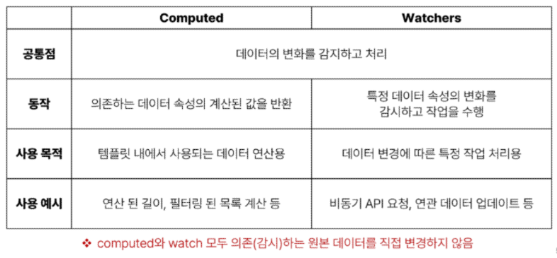

# Basic syntax - 02

----

## 1. Computed Property

### Computed()

- 계산된 속성을 정의하는 함수
- 미리 계산된 속성을 사용하여 템플릿에서 표현식을 단순하게 하고 불필요한 반복 연산을 줄임


### Computed 특징

- 반환되는 값은 computed ref 이며 일반 refs와 유사하게 계산된 결과를 .value로 참조 할 수 있음 (템플릿에서는 .value 생략 가능)
- computed 속성은 의존된 반응형 데이터를 자동으로 추적
- 의존하는 데이터가 변경될 때만 재평가
  - restOfTodos의 계산은 todo에 의존하고 있음
  - todos가 변경될 때만 restOfTodos가 업데이트 됨

```html
const restOfTodos = computed(() => {
  return todos.value.length > 0 ? '아직 남았다' : '퇴근!'
})
```

### Computed VS Methods

- computed 속성 대신 method로도 동일한 기능을 정의할 수 있음
- 두 가지 접근 방식은 실제로 완전히 동일

### Computed와 Methods 차이

- computed 속성은 의존된 반응형 데이터를 기반으로 캐시된다.
- 의존하는 데이터가 변경된 경우에만 재평가됨
- 즉, 의존된 반응형 데이터가 변경되지 않는 한 의미 계산된 결과에 대한 여러 참조는 다시 평가할 필요 없이 이전에 계산된 결과를 즉시 반환

-> 반면, method 호출은 다시 렌더링이 발생할 때마다 항상 함수를 실행


### Cache (캐시)

- 데이터나 결과를 일시적으로 저장해두는 임시 저장소
- 이후에 같은 데이터나 결과를 다시 계산하지 않고 빠르게 접근할 수 있도록 함
  
### Computed와 Methods의 적절한 사용처

- computed
  - 의존된 데이터가 변경되면 자동 없데이트
  - 의존하는 데이터에 따라 결과가 바뀌는 계산된 속성을 만들 때 유용
  - 동일한 의존성을 가진 여러 곳에서 사용할 때 계산 결과를 캐싱하여 중복 계산 방지

- method
  - 호출해야만 실행됨
  - 단순히 특정 동작을 수행하는 함수를 정의할 때 사용
  - 데이터에 의존하는지 여부와 관계없이 항상 동일한 결과를 반환하는 함수

----

## 2. Conditional Rendering

### HTML <template> element

- 페이퍼가 로드될 때 렌더링 되지 않지만 JavaScript를 사용하여 나중에 문서에서 사용할 수 있도록 하는 HTML을 보유하기 위한 메커니즘
- 보이지 않는 wrapper 역할

### v-if

- 표현식 값의 T/F를 기반으로 요소를 조건부로 렌더링
- v-if는 directive이기 때문에 단일 요소에만 연결 가능
- 이 경우 template 요소에 v-if를 사용하여 하나 이상의 요소에 대해 적용할 수 있음
- v-else, v-else-if 모두 적용 가능

### v-show

- 표현식 값의 T/F를 기반으로 요소의 가시성을 전환
- v-show 요소는 항상 렌더링 되어 DOM에 남아있음
- CSS display 속성만 전환하기 때문

### v-if VS v-show

- v-if (Cheap initial load, expensive toggle)
  - 초기 조건이 false인 경우 아무 작업도 수행하지 않음
  - 토글 비용이 높음

- v-show (Expensive initial load, cheap toggle)
  - 초기 조건에 관계 없이 항상 렌더링
  - 초기 렌더링 비용이 더 높음

-> 무언가를 매우 자주 전환해야 하는 경우에는 v-show, 실행 중에 조건이 변경되지 않는 경우에는 v-if를 권장

-----

## 3. List Rendering

### v-for

- 소스 데이터를 기반으로 요소 또는 템플릿 블록을 여러 번 렌더링
- Array, Object, Number, String, Iterable

### v-for 구조

- v-for는 alias in expression 형식의 특수 구문을 사용하여 반복되는 현재 요소에 대한 별칭(alias)을 제공

```html
<div v-for="item in items">
{{ item.text }}
</div>
```

- 인덱스에 대한 별칭을 지정할 수 있음


-----

## 4. Watchers

### watch()

- 반응형 데이터를 감시하고, 감시하는 데이터가 변경되면 콜백 함수를 호출

### watch 구조

- variable
  - 감시하는 변수


- newValue
  - 감시하는 변수가 변화된 값
  - 콜백 함수의 첫 번째 인자


- oldValue
  - 콜백 함수의 두 번째 인자

### computed와 watchers



-----

## 5. Lifecycle Hooks

### Lifecycle Hooks

- vue 인스턴스의 생애주기 동안 특정 시점에 실행되는 함수
- 개발자가 특정 단계에서 의도하는 로직이 실행될 수 있도록 함


### Lifecycle Hooks 특징

- Vue는 Lifecycle Hooks에 등록된 콜백 함수들을 인스턴스와 자동으로 연결함
- 이렇게 동작하려면 hooks 함수들은 반드시 동기적으로 작성되어야 함
- 인스턴스 생애 주기의 여러 단계에서 호출되는 다른 hooks도 있으며, 가장 일반적으로 사용되는 것은 onMounted, onUpdated, onUnmounted


------

## 6. Vue Style Guide

### Vue Style Guide

- Vue의 스타일 가이드 규칙은 우선순위에 따라 4가지 범주로 나뉨
- 규칙 범주
  - 우선순위 A : 필수 (Essential)
  - 우선순위 B : 적극 권장 (Strongly Recommended)
  - 우선순위 C : 권장 (Recommended)
  - 우선순위 D : 주의 필요 (Use with Caution)


### 우선순위 별 특징

- A (필수)
  - 오류를 방지하는 데 도움이 되므로 어떤 경우에도 규칙을 학습하고 준수

- B (적극 권장)
  - 가독성 및/또는 개발자 경험을 향상시킴
  - 규칙을 어겨도 코드는 여전히 실행되겠지만, 정당한 사유가 있어야 규칙을 위반할 수 있음

- C (권장)
  - 일관성을 보장하도록 임의의 선택을 할 수 있음

- D (주의 필요)
  - 잠재적 위험 특성을 고려함


### [주의] computed의 반환 값은 변경하지 말 것

- computed의 반환 값은 의존하는 데이터의 파생된 값
- 일종의 snapshot이며 의존하는 데이터가 변경될 때마다 새 snapshot이 생성됨
- snapshot을 변경하는 것은 의미가 없으므로 계산된 반환 값은 읽기 전용으로 취급되어야 하며 변경되어서는 안됨
- 대신 새 값을 얻기 위해서는 의존하는 데이터를 업데이트 해야 함

### [주의] computed 사용 시 원본 배열 변경하지 말 것

- computed에서 reverse() 및 sort() 사용 시 원본 배열을 변경하기 때문에 복사본을 만들어서 진행해야 함

```js
return numbers.reverse() // X

return [...numbers].reverse() // O
```

### [주의] 배열의 인덱스를 v-for의 key로 사용하지 말 것

- 인덱스는 식별자가 아닌 배열의 항목 위치만 나타내기 때문에 Vue가 DOM을 변경할 때(끝이 아닌 위치에 새 항목이 배열에 삽입되면) 여러 컴포넌트 간 데이터 공유 시 문제가 발생

- 직접 고유한 값을 만들어내는 메서드를 만들거나 외부 라이브러리 등을 활용하는 등 식별자 역할을 할 수 있는 값을 만들어냄

### v-for와 배열 - 배열 변경 감지

- 수정 메서드 (원본 배열 수정)
  - Vue는 반응형 배열의 변경 메서드가 호출되는 것을 감지하며, 필요한 업데이트를 발생시킴
  - push(), pop(), shift(), unshift(), splice(), sort(), reverse()

- 배열 교체
  - 원본 배열을 수정하지 않고 항상 새 배열을 반환
  - filter(), concat(), slice()

-------