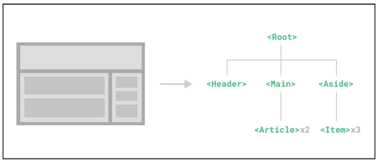
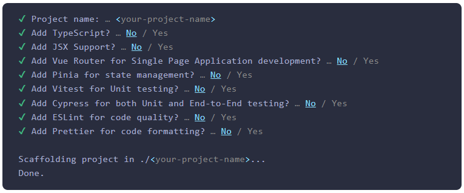
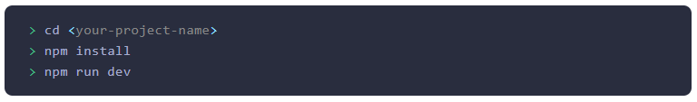

# Single-File Components

-----

## 1. Single-File Components

### Component

- 재사용 가능한 코드 블록
- UI를 독립적이고 재사용 가능한 일부분으로 분할하고 각 부분을 개별적으로 다룰 수 있음
- 자연스럽게 앱은 중첩된 Component의 트리로 구성됨




### SFC (Single-File Components)

- 컴포넌트의 템플릿, 로직 및 스타일을 하나의 파일로 묶어낸 특수한 파일 형식(.vue 파일)

### SFC 문법 개요

- 각 *.vue 파일은 세 가지 유형의 최상위 언어 블록
- <template>, <script>, <style> 으로 구성됨
- 언어 블록의 작성 순서는 상관없으나 일반적으로 template -> script -> style 순서로 작성

### 언어 블록 - <template>

- 각 *.vue 파일은 최상위 <template> 블록을 하나만 포함할 수 있음


### 언어 블록 - <script setup>

- 각 *.vue 파일은 하나의 <script setup> 블록만 포함할 수 있음 (일반 <script> 제외)
- 컴포넌트의 setup() 함수로 사용되며 컴포넌트의 각 인스턴스에 대해 실행


### 언어 블록 - <style scope>

- *.vue 파일에는 여러 <style> 태그가 포함될 수 있음
- scoped가 지정되면 CSS는 현재 컴포넌트에만 적용

-----

## 2. SFC build tool (Vite)

### Vite

- 프론트엔드 개발 도구
- 빠른 개발 환경을 위한 빌드 도구와 개발 서버를 제공

### Vite 시작하기

1. vite 프로젝트 생성

```bash
npm create vue@latest
```

2. 프로젝트 설정 관련 절차 진행



3. 프로젝트 폴더 이동 및 패키지 설치



4. Vue 프로젝트 서버 실행

```bash
npm run dev
```


### NPM (Node Package Manager)

- Node.js의 기본 패키지 관리자 

### Node.js

- Chrome의 V8 JavaScript 엔진을 기반으로 하는 Server-Side 실행 환경

### Node.js의 영향

- 기존에 브라우저 안에서만 동작할 수 있었던 JavaScript를 브라우저가 아닌 서버 측에서도 실행할 수 있게 함

- 프론트렌드와 백엔드에서 동일한 언어로 개발할 수 있게 됨

- NPM을 활용해 수많은 오픈 소스 패키지와 라이브러리를 제공하여 개발자들이 손쉽게 코드를 공유하고 재사용할 수 있게 함

### Vite 프로젝트 구조

#### node_modules

- Node.js 프로젝트에서 사용되는 외부 패키지들이 저장되는 패키지
- 프로젝트의 의존성 모듈을 저장하고 관리하는 공간
- 프로젝트가 실행될 때 필요한 라이브러리와 패키지들을 포함
- .gitignore에 작성됨

#### package-lock.json

- 패키지들의 실제 설치 버전, 의존성 관계, 하위 패키지 등을 포함하여 패키지 설치에 필요한 모든 정보를 포함

- 패키지들의 정확한 버전을 보장하여, 여러 개발자가 협업하거나 서버 환경에서 일관성 있는 의존성을 유지하는 데 도움을 줌

- npm install 명령을 통해 패키지를 설치할 때, 명시된 버전과 의존성을 기반으로 설치

#### package.json

- 프로젝트의 메타 정보와 의존성 패키지 목록을 포함

- 프로젝트의 이름, 버전, 작성자, 라이선스 등과 같은 메타 정보를 정의

- package-lock.json과 함께 프로젝트의 의존성을 관리하고, 버전 충돌 및 일관성ㅇ르 유지하는 역할

#### public 디렉토리

- 주로 다음 정적 파일을 위치 시킴
  - 소스 코드에 참조되지 않는
  - 항상

------


## 3. Vue Component


------


## 4. 참고